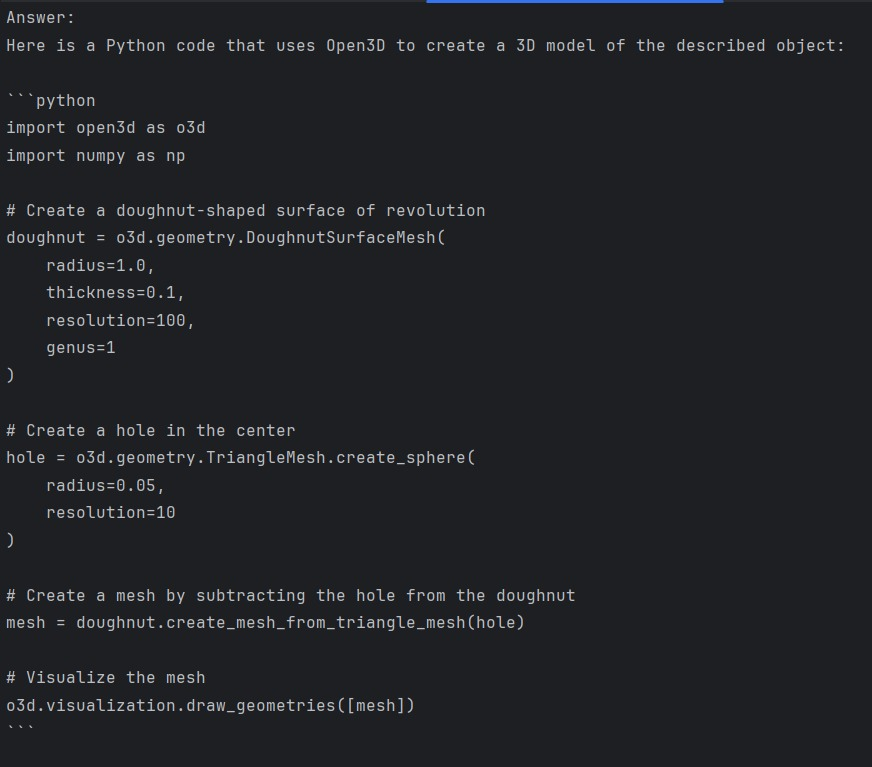

# TopoGen3D: Topology-Aware Open3D Code Generation from 2D Images

TopoGen3D is an innovative pipeline that transforms 2D images of shapes (such as a torus or a Klein bottle) into fully-functional Open3D code. By leveraging a fine-tuned CLIP model and IBM’s Granite-3B-Code-Instruct-2k model, TopoGen3D automatically identifies the best matching shape based on accuracy scores and then generates corresponding Open3D code. The resulting code can be rendered in a web environment or visualized using PyVista.

## Table of Contents
- [Overview](#overview)
- [Features](#features)
- [How It Works](#how-it-works)
- [Requirements](#requirements)
- [Installation](#installation)
- [Usage](#usage)
- [Rendering the Generated Code](#rendering-the-generated-code)
- [License](#license)

## Overview
TopoGen3D automates the process of generating 3D models from 2D images by combining advanced deep learning techniques with state-of-the-art 3D rendering tools. The pipeline consists of three main steps:

1. **2D Image Input**: Provide an image of a shape.
2. **Shape Detection & Scoring**: A fine-tuned CLIP model evaluates and scores potential shapes.
3. **3D Code Generation**: The highest-scoring shape description is fed into IBM Granite-3B-Code-Instruct-2k to generate Open3D code.

## Features
- **Topology-Aware Recognition**: Accurately identifies complex topological shapes such as torus and Klein bottles.
- **Automated Code Generation**: Transforms shape descriptions into executable Open3D code using a powerful IBM model.
- **Versatile Visualization**: Render the generated 3D model in a web application or using PyVista for interactive visualization.
- **Modular Design**: Easily integrates with various components such as CLIP, IBM Granite, and Open3D.

## How It Works
1. **Input Image**:  
   A 2D image of a shape is provided as input (e.g., a torus or a Klein bottle).

2. **Shape Scoring with CLIP**:  
   A fine-tuned CLIP model processes the image and generates accuracy scores for a range of possible shapes based on a predefined JSON knowledge base.  
   - All possible shapes and their confidence scores are printed.  
   - The shape with the highest score is selected.

3. **Code Generation with IBM Granite**:  
   The best scoring shape description is saved to a file and then fed to the IBM Granite-3B-Code-Instruct-2k model, which generates Open3D code to create a 3D model of the identified shape.

4. **Visualization**:  
   The generated Open3D code can be rendered either in a web environment or visualized using PyVista.

## Requirements
- Python 3.8+
- Transformers
- Open3D
- PyVista
- Pillow
- Other dependencies as listed in `requirements.txt` (if provided)

## Installation
1. **Clone the Repository**:
   ```bash
   git clone https://github.com/yourusername/TopGen.git
   cd TopGen
   ```

2. **Create and Activate a Virtual Environment:**
   ```bash
   python -m venv venv
   source venv/bin/activate  # On Windows: venv\Scripts\activate
   ```
3. **Install Dependencies**
    ```bash
   pip install -r requirements.txt
   ```
    
## Usage

### Step 1: Generate Image Description
Run the script to process a 2D image and generate a shape description:

```bash
python main.py
```
This script calls `clip.py` with the image path, which detects shapes and writes the highest confidence description to `description.txt`.

### Step 2: Generate 3D Open3D Code
The same `main.py` then calls `granite_code.py`, which reads the description and uses IBM Granite to generate the Open3D code.


### Step 3: Visualize the Generated Model
After code generation, use a visualization script (e.g., `visualization.py`) to render the 3D model:
```bash
python visualization.py
```


## Contributors
- [Vijay Venkatesh Murugan](https://github.com/yourusername)
- [Pradeep](https://github.com/yourusername)
- [Karthikeyan](https://github.com/yourusername)

## License
This project is licensed under the MIT License. 

---

Feel free to modify this README to suit your project's specific needs or to add any additional instructions or details about your workflow. Enjoy generating 3D models from 2D images with TopoGen3D!
